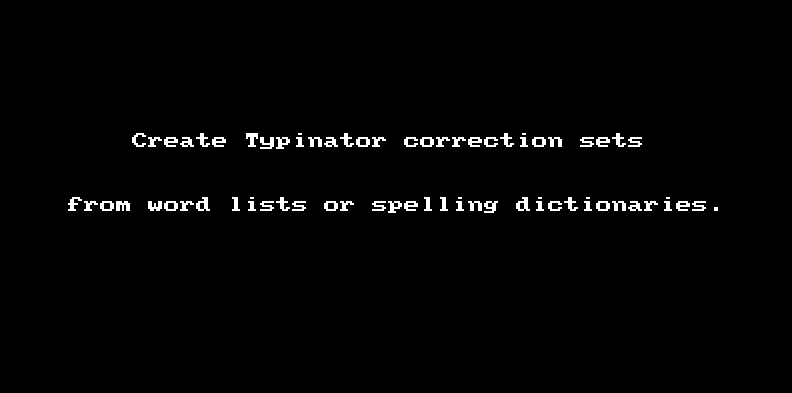

Corrections
===========

Enter the location of a spelling dictionary for the language of your choice, and generate a correction set for Typinator.

The generated set will allow you to automatically enter words in that language without diacritical marks, and have the word corrected to include diacritical marks.  This is very useful for languages like Portuguese, which have an abundance of diacritical marks, which otherwise are laborious to type.

Collisions
----------

Very often you will find that there are words which exist in both languages, but with an accent in one and not the other.  For example, the word "radio" exists in English, and the word "rádio" exists in Portuguese.  In such cases, no entry is created to turn "radio" into "rádio".  For these cases, you'll have to manually type the diacritical mark when typing in (e.g.) Portuguese.

There can also be collisions between words in the same language.  For instance, both of these words exist in Portuguese:

* chá
* chã

In this case, chá is a very common word, but chã is very rare.  (One native speaker I asked had never heard of this word, and thought I was mistaking it for chá.)  But this process is automated, so in this version of Corrections we're just leaving you to your own devices when you type "cha".

The number of cases where there are collisions is comparitively few.  There are an abundance of cases where we can automatically correct the word, saving you from finger gymnastics in 99.5% of case.  (Okay, I made that figure up, but it's a good-faith estimate. 😉 )

Roadmap: Features Under Consideration
-------------------------------------

- [ ] If there are other expansion and correction utilities that you would like supported, please let me know, and send me exports of their correction sets in every non-binary format possible.  This will allow me to inspect the format that I would need to generate to add support for that tool.

- [ ] I would like to add support for using a union of multiple word lists, since I've found some word lists to lack basic common words.

- [ ] I would like to add support for doing a look up online of frequency data for words, such as chá and chã, to determine whether one word can be ignored or not.

- [ ] Experiment with performance improvements by loading word lists into memory if they are below a threshold specified by `MAX_WORD_LIST_SIZE`.

- [ ] Add command-line options.

- [ ] Upgrade TTY to 0.7.0.

- [ ] Create an executable that can be installed with `gem install corrections`.

- [ ] Add Aruba specs.

- [ ] Add support for URLs in addition to local file paths.

- [ ] Add a library of known good URLs for downloading spelling dictionaries (I've found good ones surprisingly hard to find).

- [ ] Retry request for file location after being given a bad path (or URL).

- [ ] Consider using https://github.com/brianmario/charlock_holmes to display confidence for possible encodings.

- [ ] Add `readline` support.

- [ ] Add a (deterministic) progressbar with realistic estimates.  (Not even Apple or Microsoft or IBM can get this right! 😜)
